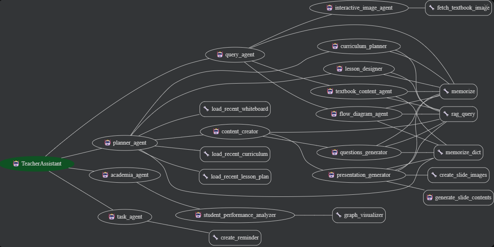

# Sahayak Agent - AI-Powered Teacher Assistant

## Overview
Sahayak Agent is an advanced AI-driven multi-agent system designed to comprehensively support teachers with educational tasks. This sophisticated platform leverages Google's Agent Development Kit (ADK) to provide an intelligent teaching assistant that handles everything from curriculum planning and lesson design to student performance analysis and task management.

The system recognizes the multifaceted challenges educators face in managing diverse teaching responsibilities and offers a streamlined, AI-powered approach to enhance teaching effectiveness and productivity.

## Key Features

| Feature | Description |
|---------|-------------|
| **Interaction Type** | Conversational Multi-Agent System |
| **Complexity** | Advanced |
| **Agent Type** | Hierarchical Multi-Agent Architecture |
| **Components** | 4 Main Agents + 12 Sub-Agents + Specialized Tools |
| **Vertical** | Education |
| **Database** | Neo4j Graph Database for Student Analytics |
| **Tools** | RAG, Image Generation, Memory Management, Reminders |

## Agent Architecture



The Sahayak Agent system employs a sophisticated hierarchical multi-agent architecture with the following components:

### Root Agent: `TeacherAssistant`
- **Role**: Main orchestrator that coordinates between all sub-agents
- **Model**: gemini-2.5-flash
- **Description**: Primary interface for teachers, routes requests to appropriate specialized agents

### Main Agents

#### 1. **Planner Agent** (`planner_agent`)
**Purpose**: Comprehensive educational planning and content creation
- **Sub-Agents**:
  - `curriculum_planner`: Creates yearly academic plans with calendar integration
  - `lesson_designer`: Develops detailed lesson plans and teaching aids
  - `content_creator`: Orchestrates educational material production
  - `presentation_generator`: Creates interactive slides with visual aids
  - `questions_generator`: Generates quizzes and assessments
  - `interactive_whiteboard`: Creates diagrams and flowcharts

**Key Capabilities**:
- Yearly curriculum planning with local context integration
- Detailed lesson plan creation with differentiation support
- Interactive presentation slide generation
- Assessment and quiz creation
- Visual content generation (diagrams, flowcharts)

#### 2. **Query Agent** (`query_agent`)
**Purpose**: Content queries and document-based inquiries
- **Sub-Agents**:
  - `textbook_content_agent`: RAG-based textbook queries with analogies
  - `interactive_image_agent`: Image fetching and marked section analysis
  - `flow_diagram_agent`: Process visualization and concept mapping

**Key Capabilities**:
- Textbook content retrieval using RAG (Retrieval-Augmented Generation)
- Interactive image analysis with marked section explanations
- Flow diagram and process chart creation
- Concept explanation with relatable analogies

#### 3. **Academia Agent** (`academia_agent`)
**Purpose**: Student performance analysis and academic insights
- **Sub-Agents**:
  - `student_performance_analyzer`: Neo4j database queries for academic analytics

**Key Capabilities**:
- Student performance tracking and analysis
- Study team formation based on complementary strengths
- Academic statistics and trend generation
- Data-driven educational recommendations

#### 4. **Task Agent** (`task_agent`)
**Purpose**: Schedule management and reminder system
**Key Capabilities**:
- Timetable management and schedule queries
- Smart reminder creation with context awareness
- Task organization and prioritization
- Friendly conversational support for daily planning

## Tools Integration

### Core Tools
- **RAG Tools**: `rag_query`, `ask_vertex_retrieval` for content retrieval
- **Image Generation**: `create_slide_images`, `fetch_textbook_image` for visual content
- **Memory Management**: `memorize`, `memorize_dict`, `memorize_list` for state persistence
- **Graph Analytics**: `GraphVisualizer` for Neo4j student performance queries
- **Reminder System**: `create_reminder` for intelligent scheduling

### Database Integration
- **Neo4j Graph Database**: Stores student performance data, relationships, and academic metrics
- **Vertex AI**: Powers the RAG system for textbook content retrieval
- **Google Cloud Storage**: Handles artifact and image storage

## Setup and Installation

### Prerequisites
- Python 3.11+
- Node.js (for Neo4j dependencies)
- Google Cloud Platform project
- Google Cloud CLI

### Installation

1. **Clone the repository**:
```powershell
git clone https://github.com/overfitagents/sahayak-agent.git
cd sahayak-agent
```

2. **Set up Python environment**:
```powershell
python -m venv env
.\env\Scripts\activate
pip install -r requirements.txt
```

3. **Install Node.js dependencies**:
```powershell
npm install
```

### Configuration

1. **Set up Google Cloud credentials**:
```powershell
$env:GOOGLE_GENAI_USE_VERTEXAI="true"
$env:GOOGLE_CLOUD_PROJECT="<your-project-id>"
$env:GOOGLE_CLOUD_LOCATION="<your-project-location>"
$env:GOOGLE_CLOUD_STORAGE_BUCKET="<your-storage-bucket>"
```

2. **Authenticate your Google Cloud account**:
```powershell
gcloud auth application-default login
gcloud auth application-default set-quota-project $env:GOOGLE_CLOUD_PROJECT
```

3. **Configure Neo4j** (for student performance analytics):
```powershell
# Set your Neo4j connection details in environment variables
$env:NEO4J_URI="bolt://localhost:7687"
$env:NEO4J_USER="neo4j"
$env:NEO4J_PASSWORD="your-password"
```

## Running the Agent

### Using Google ADK

The Agent Development Kit provides convenient ways to interact with Sahayak Agent:

#### CLI Interface
```powershell
adk run sahayak.agent:root_agent
```

#### Web Interface
```powershell
adk web
```
The web command starts a local server. Open the provided URL, select "TeacherAssistant" from the dropdown, and interact through the chatbot interface.

#### FastAPI Server
```powershell
python main.py
```
This starts the FastAPI server on `http://localhost:8080` with a web interface.

## Example Interactions

### Curriculum Planning
```
Teacher: "Create a yearly curriculum plan for Grade 8 Mathematics"
→ Routes to planner_agent → curriculum_planner
→ Analyzes grade level, calendar, and local context
→ Generates comprehensive yearly plan with monthly breakdowns
→ Includes learning objectives, activities, and assessments
```

### Lesson Design
```
Teacher: "Design a lesson plan for photosynthesis chapter"
→ Routes to planner_agent → lesson_designer
→ Uses RAG to retrieve photosynthesis content
→ Creates detailed lesson with activities and differentiation
→ Generates JSON-structured lesson plan
```

### Content Creation
```
Teacher: "Create presentation slides for cell division"
→ Routes to planner_agent → content_creator → presentation_generator
→ Generates slide contents based on lesson plan
→ Creates visual images for each slide
→ Provides engaging, localized content
```

### Student Performance Analysis
```
Teacher: "Form study teams for Grade 6 students in Science topics"
→ Routes to academia_agent → student_performance_analyzer
→ Queries Neo4j database for student performance
→ Creates balanced teams based on strengths/weaknesses
→ Returns structured JSON with team recommendations
```

### Content Queries
```
Teacher: "Explain photosynthesis with a simple analogy"
→ Routes to query_agent → textbook_content_agent
→ Uses RAG to retrieve content
→ Generates kitchen/factory analogies
→ Provides comprehensive explanation with examples
```

### Task Management
```
Teacher: "Remind me to prepare tomorrow's class materials"
→ Routes to task_agent
→ Creates intelligent reminder based on schedule
→ Sets appropriate timing (5-6 hours before deadline)
→ Maintains context for follow-up conversations
```

## Usage Workflows

### 1. **Curriculum to Content Pipeline**
```
Curriculum Planning → Lesson Design → Content Creation → Assessment Generation
```

### 2. **Query and Analysis Flow**
```
Content Query → RAG Retrieval → Analysis → Explanation with Analogies
```

### 3. **Student Analytics Workflow**
```
Performance Query → Neo4j Analysis → Team Formation → Educational Recommendations
```

## Development and Testing

### Running Tests
```powershell
# Activate virtual environment
.\env\Scripts\activate

# Run basic functionality tests
python -m pytest tests/ -v

# Test agent evaluation
python -m pytest eval/ -v
```

### Development Mode
```powershell
# Start with hot reload for development
uvicorn main:app --reload --host 127.0.0.1 --port 8080
```

## Deployment

### Google Cloud Deployment
```powershell
# Build and deploy to Google Cloud
gcloud app deploy app.yaml

# Or use Cloud Run
gcloud run deploy sahayak-agent --source .
```

### Docker Deployment
```powershell
# Build Docker image
docker build -t sahayak-agent .

# Run container
docker run -p 8080:8080 sahayak-agent
```

## Customization

### Adding New Sub-Agents
1. Create agent in appropriate subagent directory
2. Define tools and instructions
3. Register with parent agent
4. Update routing logic in coordinator

### Extending RAG Capabilities
1. Add new content sources to Vertex AI
2. Update query tools with new retrieval patterns
3. Enhance content processing pipelines

### Custom Analytics
1. Extend Neo4j schema for new data types
2. Add query patterns in GraphVisualizer tool
3. Create new analysis agents for specific metrics

## Project Structure
```
sahayak-agent/
├── main.py                     # FastAPI application entry point
├── requirements.txt            # Python dependencies
├── package.json               # Node.js dependencies
├── Dockerfile                 # Container configuration
├── sahayak/
│   ├── agent.py               # Root agent definition
│   ├── prompt.py              # Core instruction prompts
│   ├── subagents/
│   │   ├── planner/           # Planning and content creation agents
│   │   ├── query/             # Content query and retrieval agents
│   │   ├── academia/          # Student performance analysis agents
│   │   └── reminder/          # Task and reminder management
│   ├── tools/
│   │   ├── rag.py            # RAG retrieval tools
│   │   ├── image.py          # Image generation tools
│   │   ├── graph.py          # Neo4j database tools
│   │   ├── memory.py         # State management tools
│   │   └── reminder.py       # Reminder system tools
│   └── shared_libs/
│       └── types.py          # Shared data types and schemas
├── generated_images/          # Auto-generated visual content
├── interactive_images/        # Interactive teaching materials
└── env/                      # Python virtual environment
```

## Contributing

1. Fork the repository
2. Create a feature branch
3. Implement changes with appropriate tests
4. Submit a pull request with detailed description

## License

This project is licensed under the Apache License 2.0. See LICENSE file for details.

## Support

For support and questions:
- Create an issue in the GitHub repository
- Review the documentation in each subagent's README
- Check the example interactions for usage patterns

---

**Sahayak Agent** - Empowering educators with intelligent, multi-faceted AI assistance for comprehensive teaching support.